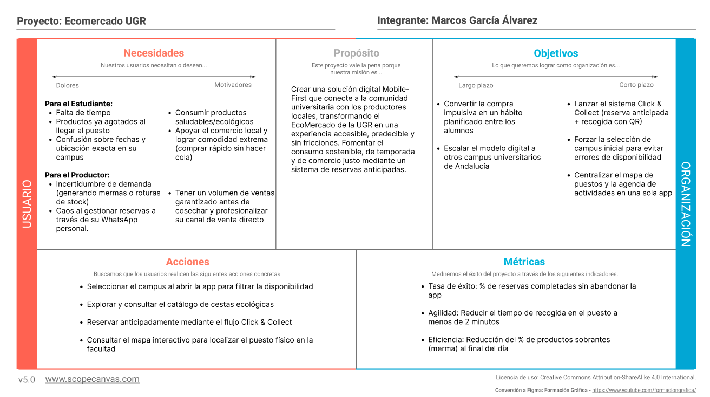
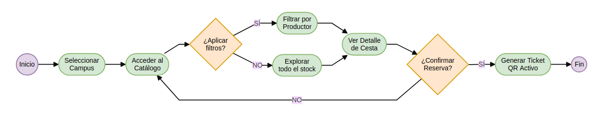
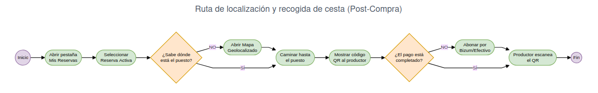
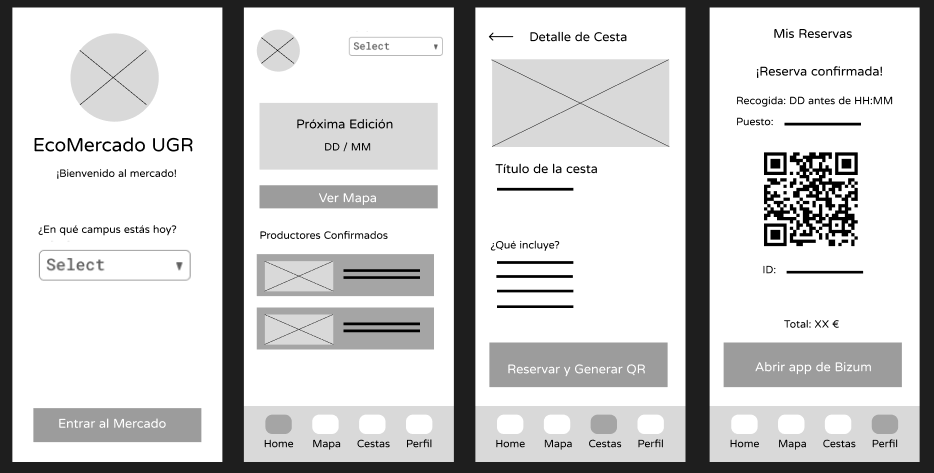
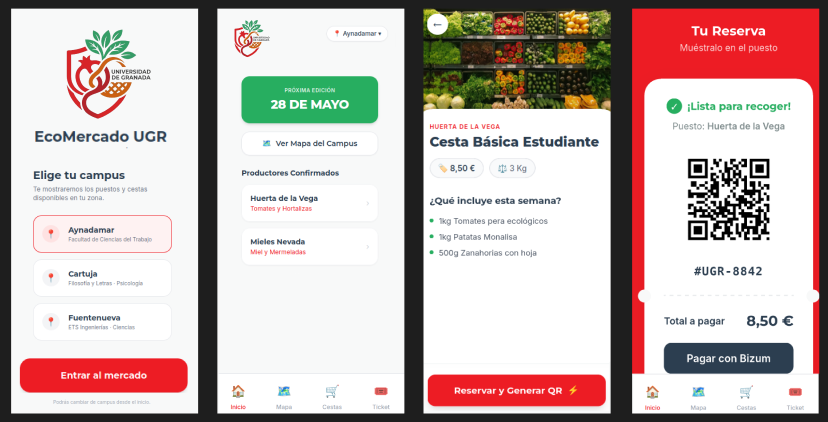

# My UX-Case Study

-----

* **Curso:** 2025/26
* **Nombre del Proyecto:** ECO MERCADO UGR
* **Estudio del caso UX realizado por:** :bust_in_silhouette: Marcos García Álvarez

### Descripción
Este proyecto plantea una solución digital integral (enfocada en formato móvil) para el **Ecomercado de la Universidad de Granada (UGR)**. El objetivo es conectar a la comunidad universitaria con productores locales, fomentando el consumo de productos de temporada, ecológicos y de comercio justo. 

A través del análisis heurístico de iniciativas reales y la aplicación de metodologías de Diseño Centrado en el Usuario (DCU), esta propuesta busca resolver las barreras de accesibilidad y visibilidad actuales, ofreciendo una experiencia interactiva que facilite la localización de puestos, la consulta de calendarios y la reserva de productos sostenibles directamente en el campus.

-----

## 1. PARTE A: Análisis Crítico del Referente (Huerta Madrid)

Para abordar este caso de estudio, se ha seleccionado la plataforma **Huerta Madrid** (`nuestrashuertas.com`) con el objetivo de evaluar su comportamiento en usabilidad, accesibilidad y experiencia de usuario. 

*   **Documento de Evaluación Completo:** [Usability Review de Huerta Madrid (PDF)](01_Investigacion_y_Estrategia/Usability-review-template-2.pdf)
*   **Matriz Escrita de Criterios (Excel):** [Usability Review Sheet (XLS)](01_Investigacion_y_Estrategia/Usability-review-template.xls)
*   **Puntuación Global Obtenida:** **72 / 100** (Nivel de Usabilidad: **Good**)

### Principales Hallazgos y Fricciones Detectadas
1.  **Catástrofe en la Prevención de Errores (Criterio 32):** El sistema permite al usuario realizar todo el flujo de selección de productos y rellenado de datos personales, notificando que "no hay reparto en su código postal" únicamente en el último paso de pago. Esto genera una tasa de abandono y frustración altísima.
2.  **Deficiencia en Accesibilidad Visual (Criterio 38):** Las tipografías de los textos secundarios emplean un tono gris claro sobre fondo blanco que viola el criterio 1.4.3 de la WCAG AA (ratio inferior a 4.5:1), limitando la legibilidad.
3.  **Falta de Aceleradores (Criterio 4):** No existen opciones de "Compra rápida" o "Repetir último pedido" para usuarios recurrentes, obligando a realizar todo el camino cognitivo en cada interacción.

---

## 2. PARTE B: Propuesta de Valor y Modelado para ECOMERCADO UGR

Tomando como base las debilidades detectadas en la competencia (Huerta Madrid) y explotando la información de las jornadas de *Impronta Granada*, el **EcoMercado UGR** se define no como un e-commerce tradicional a domicilio, sino como un **evento presencial, itinerante y comunitario dentro de los campus universitarios**.

### 2.a. Modelado de Usuarios y Mapas de Experiencia
Para empatizar y comprender las fricciones del servicio presencial, se diseñaron perfiles de usuario y diagramas de viaje detallados:

*   **Perfil 1: El Estudiante Universitario (Consumidor Target)**  
    *   **Nombre:** Javi Jódar, 22 años. Estudiante de Ingeniería Informática (Campus de Aynadamar).
    *   **UX Insight:** Necesita inmediatez. Le frustran las colas y teme acudir al mercado en su descanso de 20 minutos y que se haya agotado el stock.
    *   **Artefacto de Diseño:** [Ficha de Persona y User Journey Map 1 (PDF)](01_Investigacion_y_Estrategia/Persona%20%26%20User%20Journey%20Map_1.pdf)

*   **Perfil 2: El Productor Local (Proveedor del Mercado)**  
    *   **Nombre:** Encarni Pérez, 48 años. Agricultora de la Vega de Granada.
    *   **UX Insight:** Nivel tecnológico medio/básico. Requiere saber cuántas cestas tiene vendidas con precisión antes de salir de la huerta para no cosechar de más.
    *   **Artefacto de Diseño:** [Ficha de Persona y User Journey Map 2 (PDF)](01_Investigacion_y_Estrategia/Persona%20%26%20User%20Journey%20Map_2.pdf)

### 2.b. Definición de la Propuesta de Valor: "EcoMercado UGR App"
Diseñamos una solución bajo filosofía **Mobile-First** fundamentada en dos pilares interactivos:
1.  **Enfoque de Localización Temprana:** Al abrir la app, el usuario selecciona su campus. La interfaz filtra automáticamente las fechas de las próximas ediciones y los productores específicos que asistirán a ese espacio.
2.  **Pre-reserva Express ("Click & Collect"):** El alumno reserva su cesta ecológica con antelación. La app genera un código QR único de recogida. El cobro se realiza en mano en el puesto físico (Efectivo/Bizum), eliminando pasarelas complejas.

### 2.c. Scope Canvas: EcoMercado UGR

### 2.d. Matriz de Prioridad por Grupos de Usuario y User Flow Task Analysis

| Tareas / Casos de Uso | Estudiante (Javi) | Productor (Encarni) | Organizador (UGR) |
| :--- | :---: | :---: | :---: |
| Consultar horario y campus activo | H | L | H |
| Explorar catálogo de cestas | H | L | M |
| Reservar cesta (Click & Collect) | H | - | - |
| Consultar mapa geolocalizado | H | L | M |
| Mostrar QR para recogida | H | - | - |
| Escanear QR y confirmar entrega | - | H | L |
| Gestionar stock y añadir productos | - | H | M |
| Consultar agenda de actividades | M | M | H |

*(Leyenda: **H** = High/Alta, **M** = Medium/Media, **L** = Low/Baja, **-** = Nula)*

A continuación se detallan los diagramas de flujo de las dos tareas principales que resuelven las necesidades detectadas en el Scope Canvas:

#### Flujo Principal: Click & Collect (Pre-reserva)
**Contexto:** El estudiante necesita asegurar la compra de su cesta semanal antes de que se agote, en un proceso sin fricciones y sin pasarela de pago para recogerla rápido en su descanso.

#### Flujo Secundario: Localización y Recogida
**Contexto:** El estudiante se encuentra en el campus, abre su reserva activa y necesita localizar el puesto físico de forma guiada para abonar el importe y retirar su pedido.

### 2.c. Arquitectura de la Información (Sitemap)
Estructura clara de pestañas e interacciones globales diseñada para reducir la sobrecarga cognitiva:

### 2.d. Wireframes (Bocetos de Baja Fidelidad)
Esquema de distribución de componentes e interfaz analógica optimizada para dispositivos táctiles (siguiendo la Ley de Fitts):

*   **Pantalla de Inicio (Filtro de Contexto):** Centrada en un selector prominente de campus para mitigar errores de distribución espacial.
*   **Flujo Sin Fricciones:** Fichas de producto expandidas a pantalla completa que muestran de forma transparente el peso, contenido y precio cerrado de la cesta antes de pulsar el botón de acción principal (CTA).

### 2.e. Moodboard y Estrategia de Marca
Diseño de identidad visual que equilibra la oficialidad de la institución con la frescura de los cultivos locales de proximidad:

*   **Estrategia del Logotipo:** Isotipo moderno y minimalista que fusiona la silueta de una cesta de mimbre orgánica con una hoja viva y detalles circulares que evocan frutas/semillas, integrando el imagotipo institucional de la Universidad de Granada (UGR).
*   **Paleta de Colores Corporativa:**
    *   `#ED1C24` *(Rojo UGR)*: Aporta el respaldo institucional, oficialidad y contraste de marca.
    *   `#27AE60` *(Verde Orgánico)*: Comunica sostenibilidad, naturaleza y salud.
    *   `#F8F9F9` *(Blanco Roto)*: Fondo limpio que reduce el cansancio visual.
    *   `#2C3E50` *(Gris Antracita)*: Garantiza un contraste de lectura óptimo (WCAG AA) en textos.
    *   `#D35400` *(Tono Tierra/Arcilla)*: Detalla y aporta calidez artesanal a los elementos secundarios.
*   **Tipografía:** *Montserrat* (en pesos Bold/Black) para otorgar contundencia geométrica y moderna a los encabezados del campus, combinado con *Inter* para garantizar legibilidad de escaneo rápido en las descripciones de las cestas.

### 2.f. Mockups (Diseño de Alta Fidelidad de la Interfaz)
Estructura final de la aplicación móvil tras procesar los requerimientos de diseño limpio, alineación mediante *Auto Layout* simétrico por componentes, y consistencia de marca:

1.  **Vista 0 (Selección de Campus):** El punto de partida obligado. Presenta tarjetas de radio activas con bordes definidos para contextualizar la app.
2.  **Vista 1 (Home Dashboard):** Menú superior con el avatar del usuario y un botón dinámico flotante alineado a la parte superior derecha (`Space Between`) que permite regresar instantáneamente a la selección de campus mediante un clic. Destaca el banner verde de la próxima edición.
3.  **Vista 2 (Detalle de Cesta):** Cabecera fotográfica de alta luminosidad con tarjetas (*chips*) informativos de precio fijo (`8,50 €`) y peso (`3 Kg`).
4.  **Vista 3 (Ticket de Reserva Activa):** Fondo corporativo rojo que simula un cupón físico troquelado mediante círculos laterales. Integra un código QR digital vectorizado y un botón prioritario oscuro para agilizar el pago exterior mediante Bizum.

*   **Lienzo del Espacio de Trabajo:** [Mesa de Trabajo Completa en Figma](https://www.figma.com/board/HQefV7uz7o2UffTjgRF1U0/Mockups_ecomercado?node-id=0-1&t=S7fU00QZI71iET7B-1)

### 2.g. Prototipo Interactivo Recreado por IA (Figma Make & React)
Para validar el flujo de navegación entre pantallas (`Campus ➔ Home ➔ Cestas ➔ Detalle ➔ Generar QR ➔ Ticket`), se presenta a continuación la demo técnica del comportamiento interactivo de la interfaz:

https://github.com/user-attachments/assets/789476f3-cf45-4148-92a6-bf4859d7aa66

*   **Enlace de Navegación del Prototipo:** [App Interactiva de EcoMercado UGR](https://www.figma.com/make/ol6wTdBjItQX9e6kfF1if9/E-commerce-app-development?fullscreen=1&t=q9VdkiF9aV6B9h45-1&code-node-id=0-9)

---

## 3. PARTE C: Auto-evaluación y Conexión con las Prácticas

Este proceso de análisis y conceptualización del EcoMercado UGR constituye un ejercicio de transferencia directa de las competencias desarrolladas a lo largo de las prácticas de la asignatura.

### 3.a. Metodologías Replicadas con Éxito
*   **Auditoría Objetiva:** Al igual que en las prácticas de la asignatura se compararon plataformas culturales y de restauración (*La Qarmita*, *Mimimi*, *Ysla*), en este caso de estudio se ha sustituido la opinión estética subjetiva por una métrica cuantitativa estandarizada (los 45 puntos de usabilidad).
*   **Conversión de Errores en Soluciones de Diseño:** La capacidad para extraer *insights* de los fallos del competidor (como el problema del contraste cromático o el bloqueo tardío por localización en Huerta Madrid) y transformarlos en los pilares funcionales de la nueva propuesta de la UGR.

### 3.b. Áreas de Mejora (Limitaciones y Trabajo Futuro)
En un escenario de diseño y desarrollo profesional real, el proyecto requeriría profundizar en los siguientes aspectos que, por limitaciones de tiempo y alcance del prototipo, quedan como trabajo futuro:

1.  **Investigación de Guerrilla (User Research In Situ):** Hubiera sido fundamental realizar entrevistas breves en las cafeterías y pasillos de la UGR para validar de forma empírica si los estudiantes prefieren un modelo de reserva cerrada ("Click & Collect") o si su comportamiento de compra ecológica es puramente impulsivo al ver los puestos físicos.
2.  **Validación Cuantitativa de Usabilidad (Escala SUS):** La validación definitiva de la interfaz requeriría someter a una muestra representativa de la comunidad universitaria a pruebas de tareas estructuradas, seguidas de un cuestionario SUS (*System Usability Scale*). Esto otorgaría una métrica estandarizada y empírica (0-100) para verificar si la nueva propuesta supera con creces el 72/100 que obtuvo el referente inicial auditado (Huerta Madrid).
3.  **Análisis de Comportamiento Interactivo (Heatmaps):** De cara a un lanzamiento en beta, la implementación de mapas de calor (*Heatmaps* de clics y scroll) permitiría auditar el comportamiento silencioso del usuario. Serviría para confirmar empíricamente si la ubicación prominente del selector de campus atrapa la atención inicial, y si el diseño expandido del botón de reserva cumple verdaderamente con la Ley de Fitts en pantallas móviles táctiles reales.
4.  **Diseño del Panel del Proveedor (Back-End UI):** Una app bifásica requiere diseñar la contrapartida del agricultor. Para asegurar la viabilidad del EcoMercado, es crítico conceptualizar una interfaz extremadamente simplificada que permita a productores como Encarni actualizar sus existencias en tiempo real desde el campo.

### Conclusión Final
Este ejercicio evidencia que las metodologías de Diseño Centrado en el Usuario (DCU) aplicadas en el marco práctico de la asignatura capacitan para auditar con rigor técnico cualquier ecosistema digital, dotándonos de herramientas analíticas maduras para afrontar el planteamiento y conceptualización de productos interactivos en el mercado laboral real.
