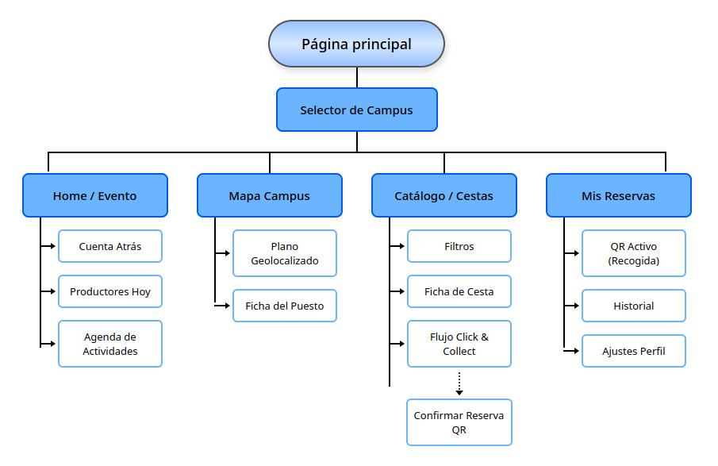

# Paso 0: My UX-Case Study

-----

* **Curso:** 2025/26
* **Nombre del Proyecto:** ECO MERCADO UGR

### Descripción
Este proyecto plantea una solución digital integral (enfocada en formato móvil) para el **Ecomercado de la Universidad de Granada (UGR)**. El objetivo es conectar a la comunidad universitaria con productores locales, fomentando el consumo de productos de temporada, ecológicos y de comercio justo. 

A través del análisis heurístico de iniciativas reales y la aplicación de metodologías de Diseño Centrado en el Usuario (DCU), esta propuesta busca resolver las barreras de accesibilidad y visibilidad actuales, ofreciendo una experiencia interactiva que facilite la localización de puestos, la consulta de calendarios y la reserva de productos sostenibles directamente en el campus.

### Estudio del caso UX realizado por: 
* :bust_in_silhouette: Marcos García Álvarez

-----

## 1. PARTE A: Análisis Crítico del Referente (Huerta Madrid)

Para abordar este caso de estudio, se ha seleccionado la plataforma **Huerta Madrid** (`nuestrashuertas.com`) con el objetivo de evaluar su comportamiento en usabilidad, accesibilidad y experiencia de usuario. 

*   **Documento de Evaluación Completo:** [Usability Review de Huerta Madrid (PDF)](Usability-review-template-2.pdf)
*   **Puntuación Global Obtenida:** **72 / 100** (Nivel de Usabilidad: **Good**)

### Principales Hallazgos y Fricciones Detectadas
1.  **Catástrofe en la Prevención de Errores (Criterio 32):** El sistema permite al usuario realizar todo el flujo de selección de productos y rellenado de datos personales, notificando que "no hay reparto en su código postal" únicamente en el último paso de pago. Esto genera una tasa de abandono y frustración altísima.
2.  **Deficiencia en Accesibilidad Visual (Criterio 38):** Las tipografías de los textos secundarios emplean un tono gris claro sobre fondo blanco que viola el criterio 1.4.3 de la WCAG AA (ratio inferior a 4.5:1), limitando la legibilidad.
3.  **Falta de Aceleradores (Criterio 4):** No existen opciones de "Compra rápida" o "Repetir último pedido" para usuarios recurrentes, obligando a realizar todo el camino cognitivo en cada interacción.

---

## 2. PARTE B: Propuesta de Valor y Modelado para ECOMERCADO UGR

Tomando como base las debilidades detectadas en la competencia (Huerta Madrid) y explotando la información de las jornadas de *Impronta Granada*, el **EcoMercado UGR** se define no como un e-commerce tradicional a domicilio, sino como un **evento presencial, itinerante y comunitario dentro de los campus universitarios**.

### 2.a. Modelado de Usuarios

#### Perfil 1: El Estudiante Universitario (Consumidor Target)
*   **Nombre:** Javi Jodar, 22 años. Estudiante de Ingeniería Informática (Campus de Aynadamar).
*   **Necesidad:** Alimentarse de forma saludable y sostenible, pero dispone de ventanas de tiempo muy estrechas (descansos de 20 minutos entre clases) y carece de vehículo propio.
*   **UX Insight:** Necesita inmediatez. Le frustran las colas y teme acudir al mercado en su descanso y que los productores ya hayan agotado el stock del día.

#### Perfil 2: El Productor Local (Proveedor del Mercado)
*   **Nombre:** Encarni Pérez, 48 años. Agricultora de la Vega de Granada.
*   **Necesidad:** Visibilizar los días que asiste a cada campus de la UGR y predecir la demanda de género para cosechar exactamente los kilos necesarios, evitando el desperdicio.
*   **UX Insight:** Su nivel tecnológico es medio/básico. Necesita una vía centralizada y ultra-simple para recibir reservas previas sin saturar su WhatsApp personal.

### 2.b. Definición de la Propuesta de Valor: "EcoMercado UGR App"
Diseñamos una solución bajo filosofía **Mobile-First** fundamentada en tres pilares interactivos:
1.  **Enfoque de Localización Temprana (Evitar Error de Huerta Madrid):** Al abrir la app, el usuario selecciona su campus. La interfaz filtra automáticamente las fechas de las próximas ediciones y los productores que asistirán a *ese* campus concreto.
2.  **Pre-reserva Express ("Click & Collect"):** El alumno reserva su cesta ecológica de temporada con antelación. La app genera un código QR de recogida rápida. El cobro se realiza físicamente en el puesto (efectivo/Bizum), eliminando pasarelas de pago complejas.
3.  **Agenda de Actividades:** Integración del programa cultural del EcoMercado (talleres ecológicos, charlas de comercio justo) para fomentar la interacción comunitaria.

### 2.c. Arquitectura de la Información (Sitemap)

*   **Secciones Principales de la App:**
    *   **Home / Evento:** Selector de campus, cuenta atrás para la próxima edición y agenda de talleres del día.
    *   **Mapa Interactivo:** Distribución geo-posicionada de los puestos en los paseos/patios de la facultad elegida.
    *   **Catálogo / Cestas:** Stock disponible de los productores locales para reserva.
    *   **Mis Reservas:** Historial y códigos QR activos para la recogida rápida en los puestos.

### 2.d. Planteamiento del Boceto (Wireframes)

A continuación se detalla la distribución de componentes visuales en formato móvil para mitigar las sobrecargas cognitivas y guiar el flujo de tareas del usuario:

[AÑADIR AQUÍ IMAGEN DE WIREFRAMES/BOCETOS: ``]

*   **Pantalla de Inicio (Filtro de Contexto):** Centrada en un selector prominente de campus. Prioriza los accesos directos al mapa físico y al listado de productores confirmados para la fecha actual, reduciendo la densidad de bloques de texto genéricos.
*   **Pantalla de Ficha y Reserva (Frictionless):** Botón de llamada a la acción (CTA) de reserva en un formato expandido a lo ancho de la pantalla (siguiendo la Ley de Fitts para entornos táctiles), mostrando de forma transparente el peso, contenido y precio cerrado de la cesta.

---

## 3. PARTE C: Auto-evaluación y Conexión con las Prácticas

Este proceso de análisis y conceptualización del EcoMercado UGR constituye un ejercicio de transferencia directa de las competencias desarrolladas a lo largo de las prácticas de la asignatura.

### 3.a. Metodologías Replicadas con Éxito
*   **Auditoría Objetiva:** Al igual que en las prácticas de la asignatura se compararon plataformas culturales y de restauración (*La Qarmita*, *Mimimi*, *Ysla*), en este caso de estudio se ha sustituido la opinión estética subjetiva por una métrica cuantitativa estandarizada (los 45 puntos de usabilidad).
*   **Conversión de Errores en Soluciones de Diseño:** La capacidad para extraer *insights* de los fallos del competidor (como el problema del contraste cromático o el bloqueo tardío por localización en Huerta Madrid) y transformarlos en los pilares funcionales de la nueva propuesta de la UGR.

### 3.b. Áreas de Mejora (Limitaciones y Trabajo Futuro)
En un escenario de diseño y desarrollo profesional real, el proyecto requeriría profundizar en los siguientes aspectos ausentes en esta iteración teórica:
1.  **Investigación de Guerrilla (User Research In Situ):** Hubiera sido fundamental realizar entrevistas breves en las cafeterías y pasillos de la UGR para validar de forma empírica si los estudiantes prefieren un modelo de reserva cerrada ("Click & Collect") o si su comportamiento de compra ecológica es puramente impulsivo al ver los puestos físicos.
2.  **Testeo de Usabilidad del Prototipo:** Llevar los bocetos de baja fidelidad a un prototipo interactivo de alta fidelidad en Figma para medir la tasa de éxito de la tarea de reserva y evaluar la interfaz mediante una escala SUS (*System Usability Scale*) con usuarios reales de la comunidad universitaria.
3.  **Diseño del Panel del Proveedor (Back-End UI):** Una app bifásica requiere diseñar la contrapartida del agricultor. Para asegurar la viabilidad del EcoMercado, es crítico diseñar una interfaz extremadamente simplificada que permita a productores como Encarni actualizar sus existencias directamente desde dispositivos móviles en el campo sin interrumpir su flujo laboral.

### 📝 Conclusión Final
Este ejercicio evidencia que las metodologías de Diseño Centrado en el Usuario (DCU) aplicadas en el marco práctico de la asignatura capacitan para auditar con rigor técnico cualquier ecosistema digital, dotándonos de herramientas analíticas maduras para afrontar el planteamiento y conceptualización de productos interactivos en el mercado laboral real.
